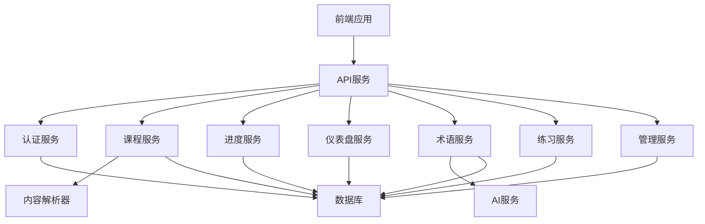

# AI培训在线学习平台 - Code Wiki

## 1. 项目整体架构

### 1.1 系统架构

AI培训在线学习平台是一个前后端分离的Web应用，采用以下架构：

- **前端**：React + Vite + TypeScript + TailwindCSS
- **后端**：FastAPI + SQLAlchemy + SQLite
- **部署**：Docker + Nginx

### 1.2 目录结构

```
ai-learning-platform/
├── backend/                # FastAPI后端
│   ├── app/                # 应用核心代码
│   │   ├── models/         # 数据库模型
│   │   ├── routers/        # API路由
│   │   ├── services/       # 业务逻辑
│   │   └── utils/          # 工具函数
│   ├── course_content/     # 课程内容文件
│   └── requirements.txt    # Python依赖
├── frontend/               # React前端
│   ├── src/                # 源代码
│   │   ├── components/     # React组件
│   │   ├── pages/          # 页面组件
│   │   ├── services/       # API服务
│   │   └── stores/         # 状态管理
│   └── package.json        # NPM依赖
├── data/                   # 数据库文件
├── scripts/                # 初始化脚本
├── deploy/                 # 部署配置
├── deploy-backend/         # 后端部署配置
├── deploy-frontend/        # 前端部署配置
├── docs/                   # 文档
├── docker-compose.yml      # Docker配置
└── README.md               # 项目说明
```

## 2. 主要模块职责

### 2.1 后端模块

| 模块 | 职责 | 文件位置 | 说明 |
|------|------|----------|------|
| **认证模块** | 用户注册、登录、JWT令牌管理 | [auth.py](file:///workspace/backend/app/routers/auth.py) | 处理用户认证相关API |
| **课程模块** | 课程内容管理、模块和课时查询 | [courses.py](file:///workspace/backend/app/routers/courses.py) | 提供课程内容API |
| **进度模块** | 学习进度追踪、状态更新 | [progress.py](file:///workspace/backend/app/routers/progress.py) | 管理学习进度数据 |
| **仪表盘模块** | 学习统计、数据可视化 | [dashboard.py](file:///workspace/backend/app/routers/dashboard.py) | 提供学习统计API |
| **术语模块** | 术语管理、AI解释生成 | [terms.py](file:///workspace/backend/app/routers/terms.py) | 处理术语相关API |
| **练习模块** | 练习题管理、答案验证 | [practice.py](file:///workspace/backend/app/routers/practice.py) | 提供练习相关API |
| **管理模块** | 后台管理功能 | [admin.py](file:///workspace/backend/app/routers/admin.py) | 提供管理员操作API |
| **AI服务** | 内容生成、术语解释 | [ai_service.py](file:///workspace/backend/app/services/ai_service.py) | 处理AI相关功能 |
| **内容解析** | 课程内容解析、渲染 | [content_parser.py](file:///workspace/backend/app/services/content_parser.py) | 解析课程内容文件 |

### 2.2 前端模块

| 模块 | 职责 | 文件位置 | 说明 |
|------|------|----------|------|
| **认证** | 用户登录、注册、状态管理 | [auth.ts](file:///workspace/frontend/src/services/auth.ts) | 处理认证相关API调用 |
| **课程** | 课程内容展示、模块管理 | [courses.ts](file:///workspace/frontend/src/services/courses.ts) | 处理课程相关API调用 |
| **管理** | 后台管理功能 | [admin.ts](file:///workspace/frontend/src/services/admin.ts) | 处理管理员API调用 |
| **状态管理** | 全局状态管理 | [authStore.ts](file:///workspace/frontend/src/stores/authStore.ts) | 使用Pinia管理认证状态 |
| **页面组件** | 各功能页面 | [pages/](file:///workspace/frontend/src/pages/) | 包含所有页面组件 |
| **自动登出** | 会话管理 | [useAutoLogout.ts](file:///workspace/frontend/src/hooks/useAutoLogout.ts) | 实现自动登出功能 |
| **时间追踪** | 学习时长统计 | [useTimeTracker.ts](file:///workspace/frontend/src/hooks/useTimeTracker.ts) | 追踪学习时间 |

## 3. 关键类与函数说明

### 3.1 后端核心类

#### 3.1.1 数据库模型

| 类名 | 说明 | 主要字段 | 文件位置 |
|------|------|----------|----------|
| **User** | 用户模型 | id, username, email, password_hash, role, group | [models.py](file:///workspace/backend/app/models/models.py#L25) |
| **Module** | 课程模块 | id, name, description, order_index | [models.py](file:///workspace/backend/app/models/models.py#L40) |
| **Lesson** | 课时模型 | id, module_id, date, title, topics, difficulty | [models.py](file:///workspace/backend/app/models/models.py#L50) |
| **Progress** | 学习进度 | id, user_id, lesson_id, status, time_spent | [models.py](file:///workspace/backend/app/models/models.py#L91) |
| **KnowledgePoint** | 知识点 | id, lesson_id, title, description, category | [models.py](file:///workspace/backend/app/models/models.py#L70) |
| **Term** | 术语 | id, term, definition, category, examples | [models.py](file:///workspace/backend/app/models/models.py#L118) |
| **PracticeQuestion** | 练习题 | id, knowledge_point_id, question_type, question_text | [models.py](file:///workspace/backend/app/models/models.py#L147) |
| **AISettings** | AI设置 | id, provider, openai_api_key, local_model_url | [models.py](file:///workspace/backend/app/models/models.py#L176) |

#### 3.1.2 主要API函数

| 函数名 | 说明 | 路由 | 文件位置 |
|--------|------|------|----------|
| **register** | 用户注册 | POST /api/auth/register | [auth.py](file:///workspace/backend/app/routers/auth.py) |
| **login** | 用户登录 | POST /api/auth/login | [auth.py](file:///workspace/backend/app/routers/auth.py) |
| **get_modules** | 获取模块列表 | GET /api/courses/modules | [courses.py](file:///workspace/backend/app/routers/courses.py) |
| **get_lesson** | 获取课时详情 | GET /api/courses/lessons/{id} | [courses.py](file:///workspace/backend/app/routers/courses.py) |
| **update_progress** | 更新学习进度 | PUT /api/progress/{id} | [progress.py](file:///workspace/backend/app/routers/progress.py) |
| **get_dashboard_stats** | 获取仪表盘统计 | GET /api/dashboard/stats | [dashboard.py](file:///workspace/backend/app/routers/dashboard.py) |
| **get_term** | 获取术语详情 | GET /api/terms/{term} | [terms.py](file:///workspace/backend/app/routers/terms.py) |
| **get_practice_questions** | 获取练习题 | GET /api/practice/questions/{knowledge_point_id} | [practice.py](file:///workspace/backend/app/routers/practice.py) |
| **update_ai_settings** | 更新AI设置 | PUT /api/admin/ai-settings | [admin.py](file:///workspace/backend/app/routers/admin.py) |

### 3.2 前端核心函数

| 函数名 | 说明 | 模块 | 文件位置 |
|--------|------|------|----------|
| **login** | 用户登录 | 认证服务 | [auth.ts](file:///workspace/frontend/src/services/auth.ts) |
| **register** | 用户注册 | 认证服务 | [auth.ts](file:///workspace/frontend/src/services/auth.ts) |
| **getModules** | 获取模块列表 | 课程服务 | [courses.ts](file:///workspace/frontend/src/services/courses.ts) |
| **getLesson** | 获取课时详情 | 课程服务 | [courses.ts](file:///workspace/frontend/src/services/courses.ts) |
| **updateProgress** | 更新学习进度 | 课程服务 | [courses.ts](file:///workspace/frontend/src/services/courses.ts) |
| **getDashboardStats** | 获取仪表盘统计 | 课程服务 | [courses.ts](file:///workspace/frontend/src/services/courses.ts) |
| **useAuthStore** | 认证状态管理 | 状态管理 | [authStore.ts](file:///workspace/frontend/src/stores/authStore.ts) |
| **useAutoLogout** | 自动登出 | 钩子 | [useAutoLogout.ts](file:///workspace/frontend/src/hooks/useAutoLogout.ts) |
| **useTimeTracker** | 学习时间追踪 | 钩子 | [useTimeTracker.ts](file:///workspace/frontend/src/hooks/useTimeTracker.ts) |

## 4. 依赖关系

### 4.1 后端依赖

| 依赖 | 版本/说明 | 用途 | 来源 |
|------|-----------|------|------|
| FastAPI | Web框架 | 构建API | [requirements.txt](file:///workspace/backend/requirements.txt) |
| SQLAlchemy | ORM | 数据库操作 | [requirements.txt](file:///workspace/backend/requirements.txt) |
| Pydantic | 数据验证 | 请求/响应模型 | [requirements.txt](file:///workspace/backend/requirements.txt) |
| PyJWT | JWT库 | 认证令牌 | [requirements.txt](file:///workspace/backend/requirements.txt) |
| Passlib | 密码哈希 | 密码加密 | [requirements.txt](file:///workspace/backend/requirements.txt) |
| Python-Markdown | Markdown解析 | 内容渲染 | [requirements.txt](file:///workspace/backend/requirements.txt) |
| OpenAI | API客户端 | AI功能 | [requirements.txt](file:///workspace/backend/requirements.txt) |

### 4.2 前端依赖

| 依赖 | 版本/说明 | 用途 | 来源 |
|------|-----------|------|------|
| React | UI库 | 前端界面 | [package.json](file:///workspace/frontend/package.json) |
| TypeScript | 类型系统 | 类型安全 | [package.json](file:///workspace/frontend/package.json) |
| Vite | 构建工具 | 开发与构建 | [package.json](file:///workspace/frontend/package.json) |
| TailwindCSS | CSS框架 | 样式设计 | [package.json](file:///workspace/frontend/package.json) |
| React Router | 路由库 | 页面导航 | [package.json](file:///workspace/frontend/package.json) |
| Axios | HTTP客户端 | API调用 | [package.json](file:///workspace/frontend/package.json) |
| Pinia | 状态管理 | 全局状态 | [package.json](file:///workspace/frontend/package.json) |

### 4.3 服务依赖关系



## 5. 项目运行方式

### 5.1 Docker部署（推荐）

```bash
# 克隆或进入项目目录
cd ai-learning-platform

# 启动服务
docker-compose up -d

# 访问
# 前端: http://localhost
# API文档: http://localhost:8000/docs
```

### 5.2 本地开发

#### 5.2.1 后端

```bash
cd backend

# 创建虚拟环境
python -m venv venv
source venv/bin/activate  # Linux/Mac
# 或 venv\Scripts\activate  # Windows

# 安装依赖
pip install -r requirements.txt

# 初始化数据库
python ../scripts/init_db.py

# 启动服务
uvicorn app.main:app --reload --port 8000
```

#### 5.2.2 前端

```bash
cd frontend

# 安装依赖
npm install

# 启动开发服务器
npm run dev
```

### 5.3 环境变量

| 变量 | 描述 | 默认值 | 来源 |
|------|------|--------|------|
| DATABASE_URL | 数据库连接 | sqlite:///./data/learning.db | [config.py](file:///workspace/backend/app/config.py) |
| SECRET_KEY | JWT密钥 | your-secret-key-change-in-production | [config.py](file:///workspace/backend/app/config.py) |
| OPENAI_API_KEY | OpenAI API密钥 | (可选) | [config.py](file:///workspace/backend/app/config.py) |
| CONTENT_PATH | 课程内容路径 | ../AI Courses | [config.py](file:///workspace/backend/app/config.py) |

## 6. 核心功能特性

### 6.1 课程管理

- **模块视图**：按模块组织课程内容
- **时间线视图**：按日期展示课程进度
- **Markdown/Notebook渲染**：支持多种内容格式
- **课程材料**：相关资源链接和参考资料

### 6.2 学习进度

- **状态追踪**：未开始、进行中、已完成
- **时长统计**：记录学习时间
- **完成率计算**：自动计算学习进度
- **书签功能**：标记重要内容

### 6.3 知识扩展

- **术语提取**：自动识别课程中的专业术语
- **AI生成解释**：基于AI的术语解释
- **相关资源**：外部链接和参考资料
- **知识点关联**：建立知识点之间的联系

### 6.4 学习仪表盘

- **统计数据**：学习时长、完成课程数
- **学习日历**：可视化学习活动
- **连续学习天数**：鼓励持续学习
- **进度趋势**：学习进展分析

### 6.5 练习系统

- **多种题型**：选择题、简答题等
- **难度分级**：适应不同学习水平
- **答案验证**：自动判断答案正确性
- **解析说明**：提供详细的题目解析

### 6.6 管理功能

- **用户管理**：用户信息和权限管理
- **课程管理**：课程内容和结构调整
- **AI设置**：配置AI服务参数
- **数据统计**：平台使用情况分析

## 7. API端点

| 端点 | 方法 | 描述 | 模块 |
|------|------|------|------|
| /api/auth/register | POST | 用户注册 | 认证 |
| /api/auth/login | POST | 用户登录 | 认证 |
| /api/courses/modules | GET | 获取模块列表 | 课程 |
| /api/courses/lessons/{id} | GET | 获取课时详情 | 课程 |
| /api/progress | GET | 获取学习进度 | 进度 |
| /api/progress/{id} | PUT | 更新学习进度 | 进度 |
| /api/dashboard/stats | GET | 获取学习统计 | 仪表盘 |
| /api/terms/{term} | GET | 获取术语详情 | 术语 |
| /api/terms | POST | 创建术语 | 术语 |
| /api/practice/questions/{knowledge_point_id} | GET | 获取练习题 | 练习 |
| /api/practice/answers | POST | 提交答案 | 练习 |
| /api/admin/ai-settings | GET | 获取AI设置 | 管理 |
| /api/admin/ai-settings | PUT | 更新AI设置 | 管理 |

## 8. 技术栈

| 类别 | 技术 | 版本/说明 | 用途 |
|------|------|-----------|------|
| 前端 | React | 18+ | UI库 |
| 前端 | TypeScript | 5+ | 类型系统 |
| 前端 | Vite | 5+ | 构建工具 |
| 前端 | TailwindCSS | 4+ | CSS框架 |
| 前端 | React Router | 6+ | 路由库 |
| 前端 | Pinia | 2+ | 状态管理 |
| 后端 | FastAPI | 0.100+ | Web框架 |
| 后端 | SQLAlchemy | 2+ | ORM |
| 后端 | SQLite | 3+ | 数据库 |
| 后端 | PyJWT | 2+ | JWT认证 |
| 部署 | Docker | 20+ | 容器化 |
| 部署 | Nginx | 1.20+ | 反向代理 |

## 9. 部署与维护

### 9.1 Docker部署

使用 `docker-compose.yml` 配置文件进行容器化部署，包含以下服务：
- **backend**：FastAPI后端服务
- **frontend**：React前端应用
- **nginx**：反向代理服务器

### 9.2 数据管理

- **初始化**：使用 `scripts/init_db.py` 初始化数据库
- **课程内容**：存储在 `backend/course_content/` 目录
- **数据备份**：定期备份 `data/` 目录中的数据库文件

### 9.3 安全考虑

- **密码加密**：使用 Passlib 进行密码哈希
- **JWT认证**：使用 PyJWT 生成和验证令牌
- **CORS设置**：配置跨域资源共享
- **API密钥**：敏感信息通过环境变量配置

## 10. 开发指南

### 10.1 代码规范

- **后端**：遵循 PEP 8 代码风格
- **前端**：遵循 ESLint 和 Prettier 规范
- **命名约定**：使用 snake_case（后端）和 camelCase（前端）

### 10.2 测试

- **API测试**：使用 `test_api.py` 测试API功能
- **内容测试**：使用 `test_content.py` 测试内容解析
- **练习测试**：使用 `test_practice.py` 测试练习系统

### 10.3 扩展开发

- **新API**：在 `routers/` 目录添加新路由
- **新服务**：在 `services/` 目录添加新业务逻辑
- **新模型**：在 `models/` 目录添加新数据库模型
- **新页面**：在 `frontend/src/pages/` 目录添加新页面组件

## 11. 故障排查

### 11.1 常见问题

| 问题 | 可能原因 | 解决方案 |
|------|----------|----------|
| 数据库连接失败 | 数据库文件权限问题 | 检查文件权限，确保可读写 |
| API返回500错误 | 服务器内部错误 | 查看服务器日志，定位具体错误 |
| 前端无法访问API | CORS配置问题 | 检查后端CORS设置 |
| 课程内容不显示 | 内容路径配置错误 | 检查 CONTENT_PATH 环境变量 |
| AI功能不可用 | API密钥未配置 | 设置 OPENAI_API_KEY 环境变量 |

### 11.2 日志管理

- **后端日志**：FastAPI 自动生成日志
- **前端日志**：浏览器控制台查看
- **Docker日志**：使用 `docker logs` 命令查看

## 12. 项目未来规划

### 12.1 功能扩展

- **多语言支持**：添加多语言课程内容
- **社交功能**：学习社区、讨论论坛
- **个性化推荐**：基于学习历史的课程推荐
- **证书系统**：完成课程后颁发证书

### 12.2 技术升级

- **数据库迁移**：考虑使用 PostgreSQL 提升性能
- **缓存系统**：添加 Redis 缓存提升响应速度
- **CI/CD**：实现自动化测试和部署
- **监控系统**：添加应用性能监控

### 12.3 教育功能

- **学习路径**：设计个性化学习路径
- **评估系统**：更全面的学习评估
- **协作学习**：小组学习和协作项目
- **导师系统**：添加导师指导功能

---

## 13. 总结

AI培训在线学习平台是一个功能完整的在线教育系统，专注于Context Engineering综合课程的学习管理。系统采用现代化的技术栈，提供了课程管理、学习进度追踪、知识扩展、学习仪表盘和练习系统等核心功能。

通过Docker容器化部署，系统具有良好的可移植性和可扩展性。未来可以通过功能扩展和技术升级，进一步提升平台的教育价值和用户体验。